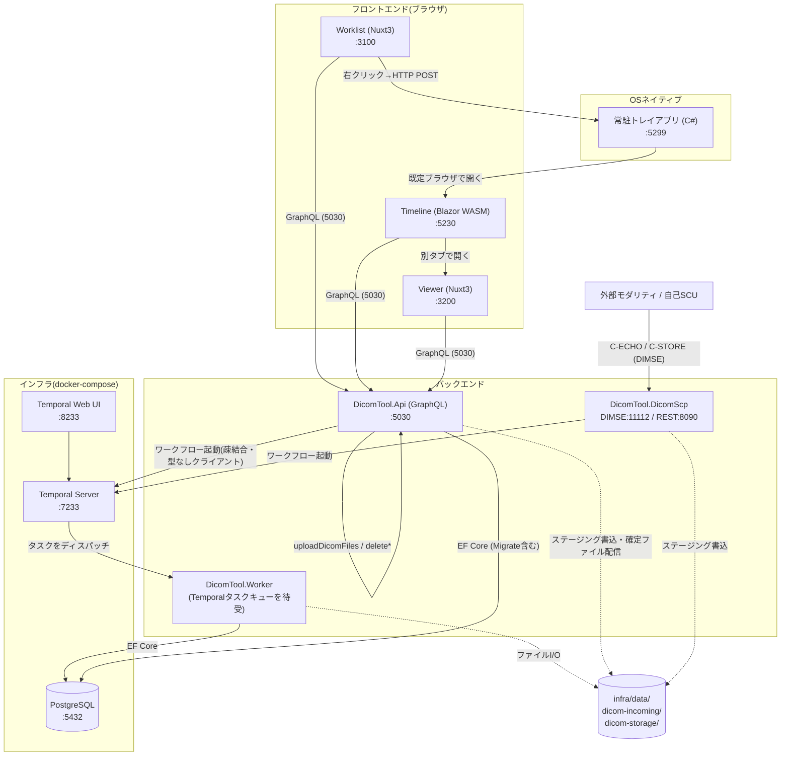

# アーキテクチャ概要

> ポート番号・識別子など「値そのもの」の唯一の正は [`CONTRACT.md`](./CONTRACT.md)。
> このドキュメントは「全体がどう繋がっているか」を俯瞰するためのもの。

## サービス構成図

## 1. なぜこの構成なのか

実務のPACS/院内システムは、「1つの巨大アプリ」ではなく複数の独立したサービスが緩く連携して動く。
このリポジトリはその感覚を学習用に再現している:

- **Worklist / Viewer / Timeline が別プロセス・別ポート**: 実務では改修頻度・チーム・デプロイ単位が
  アプリごとに異なることが多く、独立してリリースできる構成が好まれる。
- **常駐トレイアプリが仲介**: ブラウザは他プロセスを起動できないため、OSネイティブなアプリが
  「ブラウザからの命令を受けてOS操作をする」橋渡し役になる（Discord/LINE等の通知アプリと同じ発想）。
- **Temporalが「ストレージ操作」と「DB操作」を仲介**: アップロード・削除はどちらも「ファイルI/O」と
  「DB更新」という性質の異なる2つの操作からなる。片方だけ成功して片方が失敗する事故
  （ファイルは保存されたがDBレコードが無い、等）をリトライで防ぐため、Temporalワークフローが
  間に入る。
- **DICOM C-STOREとGraphQL uploadDicomFilesが同じワークフローに合流**: 実務では「モダリティからの
  自動送信」と「担当者による手動アップロード」が両方存在することが多い。入口のプロトコルが違っても
  後段の処理（保存・登録）は共通化できる、という設計を体験できる。

## 2. リクエストフロー例：ブラウザから検査をアップロードする

1. ユーザーがWorklist(`:3100`)の `upload.vue` からファイルを選択。
2. Worklistが `uploadDicomFiles` GraphQL Mutationを Api(`:5030`) に送信（HTTPマルチパート）。
3. Apiはファイルを **確定保存せず** `infra/data/dicom-incoming/` に一時保存し、Temporalへ
   `UploadDicomWorkflow` の起動を依頼して即座に「受理しました」を返す。
4. Temporal ServerがTask Queue(`dicom-tool-task-queue`)にタスクを積む。
5. Worker(`services/DicomTool.Worker`)がタスクを拾い、`SaveToStorageActivity`(fo-dicomでタグ解析
   ＋ `infra/data/dicom-storage/{Study}/{Series}/{Sop}.dcm` へ確定保存)→
   `RegisterDicomRecordActivity`(PostgreSQLへupsert) を順に実行。
6. Worklistが再度 `studies` Queryを叩くと、登録済みの検査が見えるようになる
   （非同期処理のため、アップロード直後は一覧にまだ出ないことがある＝実務のPACSでも起こりうる挙動）。

## 3. リクエストフロー例：外部モダリティから画像を送る

1. モダリティ(またはこのリポジトリのSCU自己テスト機能)が DicomScp(`:11112`) にC-STOREでDICOM画像を送信。
2. `DicomScpService.OnCStoreRequestAsync` が受信し、`infra/data/dicom-incoming/` へ保存。
3. 以降はブラウザアップロードと全く同じ `UploadDicomWorkflow` に合流する(手順4以降は2章と同じ)。

## 4. 認証・データ整合性の要点

- 認証はJWTをhttpOnly Cookieで保持（`AppConstants.AuthCookieName`）。Worklist/Viewer/Timelineは
  いずれもApi(`:5030`)に対して`credentials: include`でリクエストする。
- DBマイグレーションの適用は **Api専任**（`services/DicomTool.Worker`は適用しない。CONTRACT.md 7章）。
- `shared/DicomTool.Shared` がEF Coreエンティティ・DbContext・マイグレーション・定数・
  Temporal入力DTOの「唯一の正」。Api/Worker/DicomScp/TrayAppはすべてこれを参照する
  （Blazor WASMのTimelineだけはEF Core/Npgsqlを含められないため、ポート番号等は
  `frontend/timeline/DicomTool.Timeline/Constants/ExternalServiceUrls.cs` に手動で複製している）。

## 5. 各サービスの実装状況サマリー

| サービス | 実装内容 | 検証状況 |
|---|---|---|
| `shared/DicomTool.Shared` | エンティティ・DbContext・初期マイグレーション・定数・Temporal DTO | `dotnet build`成功 |
| `backend/DicomTool.Api` | GraphQL API、PostgreSQL移行、アップロード/削除の非同期(Temporal)化 | ビルド成功、実起動でPostgreSQL/Temporal接続確認済み |
| `services/DicomTool.DicomScp` | fo-dicomによるC-ECHO/C-STORE SCU/SCP、管理REST API+Swagger | ビルド成功、C-ECHO/C-STORE自己疎通テスト成功（実機） |
| `services/DicomTool.Worker` | UploadDicomWorkflow/DeleteDicomWorkflowとその4 Activity | ビルド成功、実際にワークフローを実行しPostgreSQLへの登録・削除まで確認済み |
| `services/DicomTool.TrayApp` | NotifyIcon常駐 + ローカルHTTP API + Swagger | ビルド成功、`/health`・`/commands/open-timeline`をHTTPで実行確認済み |
| `frontend/worklist` | 検査一覧・アップロード・ログイン・トレイアプリ連携 | `npm install`/`npm run build`成功 |
| `frontend/viewer` | 画像ビューア単体アプリ | `npm install`/`npm run build`成功 |
| `frontend/timeline` | 患者タイムライン、Viewerへの別タブ導線 | ビルド成功、実ブラウザ(Playwright)でのレンダリング確認済み |

## 6. 既知の未対応・今後の余地

- IIS/Windows Server/実VM(`192.168.93.128`)への配置手順は本リポジトリのコードの外側の作業。
  [`手動セットアップ手順.md`](../手動セットアップ手順.md)を参照。
- C-FIND/C-MOVE等、C-ECHO/C-STORE以外のDIMSEサービスは未実装（提案書7章の「将来的な確認事項」）。
- Worklist/Viewer/Timelineの認証状態は個別にCookieへ依存しており、SSO的な仕組みは無い
  （3サービスとも同一オリジンのApiにCookieを送るため、ブラウザが同一なら実用上は問題にならない）。
- `docker compose`のTemporal可視性ストアはPostgreSQL(SQL visibility)構成。大規模になる場合は
  Elasticsearchへの切り替えが実務では検討される（学習規模では不要）。
