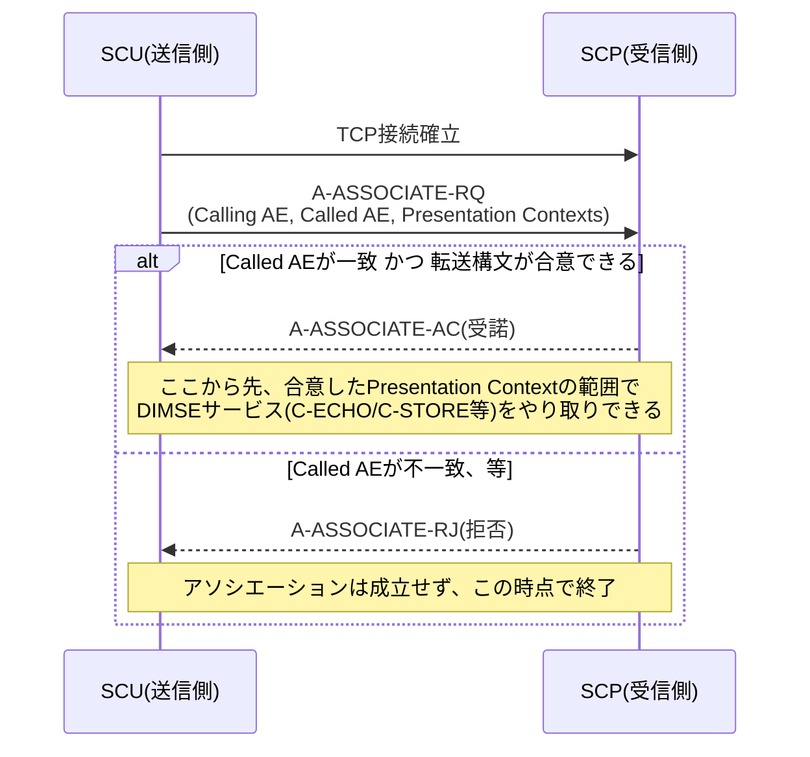
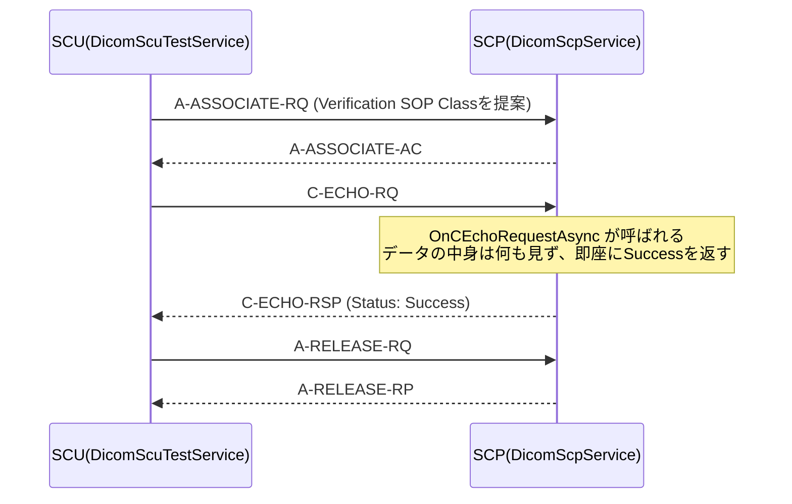
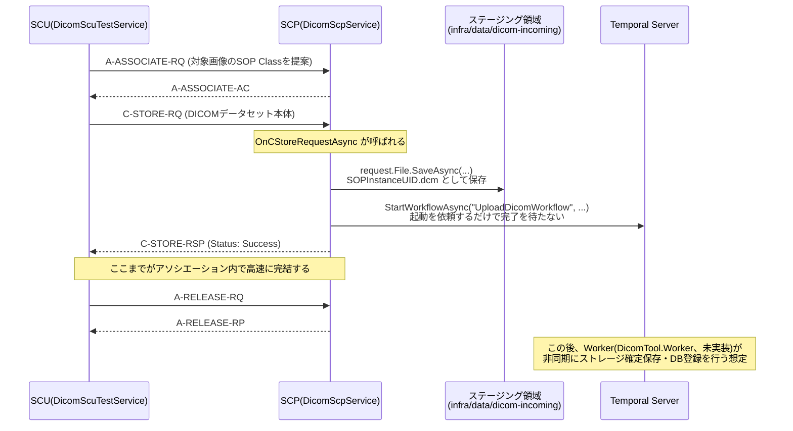

# DICOM通信プロトコル 学習ガイド

> このドキュメントは `services/DicomTool.DicomScp` で実装したDICOM SCU/SCP機能を理解するための
> 学習用資料です。実装コード自体にも非常に丁寧な日本語コメントを入れているので、
> このドキュメントと実装コードを行き来しながら読むことを想定しています。
>
> 関連ファイル:
> - `services/DicomTool.DicomScp/Services/DicomScpService.cs` … SCP(受信側)本体
> - `services/DicomTool.DicomScp/Services/DicomScpHostedService.cs` … SCPをASP.NET Coreホストに載せる橋渡し役
> - `services/DicomTool.DicomScp/Services/DicomScuTestService.cs` … SCU(送信側)自己疎通テスト
> - `services/DicomTool.DicomScp/Services/TemporalWorkflowStarter.cs` … C-STORE受信後のTemporal連携
> - `services/DicomTool.DicomScp/Program.cs` … 全体の配線(DI登録・管理用REST API)
> - `docs/CONTRACT.md` … サービス間の唯一の正となる契約ドキュメント(ポート・AEタイトル等)

---

## 1. SCU/SCPという用語

DICOMの世界では通信の役割を「クライアント/サーバー」ではなく、次の2つの用語で呼ぶ。

| 用語 | 正式名称 | 意味 |
|---|---|---|
| **SCU** | Service Class User | あるサービス(C-ECHOやC-STOREなど)を**利用する側**。多くの場合、接続を開始する側。 |
| **SCP** | Service Class Provider | あるサービスを**提供する側**。多くの場合、待受(リスニング)している側。 |

ポイントは、SCU/SCPは「サービスクラスごと」に決まる役割だということ。たとえば：

- C-STORE(画像送信)というサービスクラスにおいては、画像を送るモダリティが「C-STORE SCU」、
  受け取るPACSが「C-STORE SCP」。
- C-FIND(検索、本プロジェクトでは未実装)というサービスクラスにおいては、
  検索をかけるワークステーションが「C-FIND SCU」、検索対象のデータを持つPACSが「C-FIND SCP」。

同じ機器が「あるサービスではSCU、別のサービスではSCP」になることも普通にある。
本プロジェクトの `DicomTool.DicomScp` は、C-ECHO/C-STOREの**SCP**として常時待ち受けつつ、
自己疎通テストのためだけに一時的に**SCU**にもなる(`DicomScuTestService`)、という両方の顔を持つ。

---

## 2. DICOM Upper Layer Protocol の全体像

DICOMのネットワーク通信は、TCP/IPの上にさらに独自の階層(Upper Layer Protocol, ULP)を重ねている。
HTTPのような「1リクエスト=1レスポンスで完結」のプロトコルとは異なり、DICOMは
「まずセッション(アソシエーション)を張り、その中で複数のコマンド(C-ECHOやC-STORE)を
やり取りし、最後にセッションを閉じる」という、電話の通話に近い構造を持つ。

```
TCP/IPコネクション確立 (3-way handshake)
        │
        ▼
┌─────────────────────────────────────────┐
│ アソシエーション(Association)             │  ← DICOM Upper Layer Protocolが管理する
│  ・A-ASSOCIATE-RQ/AC/RJ で確立            │    「論理的なセッション」
│  ・この中で複数のDIMSEサービスを実行可能   │
│    (C-ECHO, C-STORE, ...)                │
│  ・A-RELEASE-RQ/RP で正常終了            │
│    (またはA-ABORTで異常終了)             │
└─────────────────────────────────────────┘
        │
        ▼
TCP/IPコネクション切断
```

- **PDU (Protocol Data Unit)**: DICOM ULP上でやり取りされるメッセージの単位。
  A-ASSOCIATE-RQ/AC/RJ、P-DATA-TF(実データ転送)、A-RELEASE-RQ/RP、A-ABORTなどの種類がある。
  fo-dicomはこのPDUの組み立て・解析を全て隠蔽してくれるため、アプリケーションコードは
  「アソシエーション要求が来たらどう応答するか」「C-ECHO要求が来たらどう応答するか」といった
  **意味レベル**のことだけを考えればよい。
- **DIMSE (DICOM Message Service Element)**: アソシエーションの中で実際にやり取りされる
  「コマンド」の総称。C-ECHO、C-STORE、C-FIND、C-MOVEなどがある。本プロジェクトはC-ECHOと
  C-STOREのみを実装している。

---

## 3. アソシエーション確立とAEタイトルの役割

### 3-1. A-ASSOCIATE-RQ/AC/RJ の流れ



### 3-2. AEタイトル(Application Entity Title)とは

AEタイトルは、DICOM機器/システムが自分自身に付ける「名前」で、最大16文字の識別子。
IPアドレス・ポート番号だけでなく、この名前も一致しないとアソシエーションを張れない
(＝通信できない)、というのがDICOM独特の仕組み。

A-ASSOCIATE-RQには次の2つのAEタイトルが含まれる：

- **Calling AE Title**: 接続を開始した側(SCU)が名乗る自分の名前。
- **Called AE Title**: 接続先として指定した相手(SCP)の名前。

このリポジトリでは：

| 項目 | 値 | 定義場所 |
|---|---|---|
| 自システム(SCP)のAEタイトル | `DICOMTOOL3` | `DicomNetworkConstants.OwnAeTitle` |
| 自己疎通テスト用SCUのAEタイトル | `DICOMTOOL3SCU` | `DicomNetworkConstants.TestScuAeTitle` |

### 3-3. 【実装で体験できる学習ポイント】AEタイトル不一致による拒否

fo-dicomのデフォルト動作は「Called AE Titleが何であっても受け入れる」というものであり、
AEタイトルの検証は**アプリケーション側が明示的に実装する必要がある**。

`DicomScpService.OnReceiveAssociationRequestAsync` では、あえて次のチェックを入れている：

```csharp
if (association.CalledAE != DicomNetworkConstants.OwnAeTitle)
{
    return SendAssociationRejectAsync(
        DicomRejectResult.Permanent,
        DicomRejectSource.ServiceUser,
        DicomRejectReason.CalledAENotRecognized);
}
```

これにより、「間違ったAEタイトル宛てに接続しようとすると拒否される」という、実務のPACSで
非常によく起きるトラブル(「相手先AEタイトルのスペルミスで疎通できない」等)をコード上で
再現・体験できるようにしている。

---

## 4. プレゼンテーションコンテキストと転送構文のネゴシエーション

### 4-1. プレゼンテーションコンテキスト(Presentation Context)とは

A-ASSOCIATE-RQの中には、SCUが「これから何を話したいか」を提案する
**プレゼンテーションコンテキスト**のリストが含まれる。1つのプレゼンテーションコンテキストは
次の情報の組で構成される：

- **Abstract Syntax (SOP Class UID)**: 「何について話すか」。たとえば
  「Secondary Capture Image Storage」(単純な画像保存)や「Verification」(C-ECHO用)など、
  DICOM規格で定義された「サービス+情報オブジェクトの種類」を一意なUIDで表す。
- **Transfer Syntax候補のリスト**: 「そのAbstract Syntaxのデータを、バイト列としてどう
  符号化して送りたいか」の候補一覧(複数個を優先順位付きで提案できる)。

1つのアソシエーションの中に複数のプレゼンテーションコンテキストを含めることができ、
それぞれが独立してAccept(採用)/Reject(拒否)される。つまり「このSOP Classは使えるが、
あのSOP Classは使えない」という**粒度の細かい合意**が可能。

### 4-2. 転送構文(Transfer Syntax)のネゴシエーション

転送構文は「データセットをバイト列としてどう符号化するか」の取り決め。代表例：

| 転送構文 | 特徴 |
|---|---|
| Implicit VR Little Endian | タグの型(VR: Value Representation)を明示せず、規格書の定義から暗黙的に決める。全DICOM機器が最低限サポートを義務付けられている「デフォルト転送構文」。 |
| Explicit VR Little Endian | タグごとにVRをバイト列に明示的に含める。曖昧さがなく現代的。 |
| Explicit VR Big Endian | 上記のバイトオーダーをビッグエンディアンにしたもの(規格上は非推奨だが後方互換のため残る)。 |
| (JPEG等の圧縮系) | 本プロジェクトでは学習用にシンプルさを優先し、非圧縮の転送構文のみサポート。 |

SCP側(`DicomScpService`)は、SCUが提案してきた転送構文の候補と、自分がサポートする
転送構文の一覧(`AcceptedTransferSyntaxes`)の**積集合**を取り、最初に一致したものを
そのプレゼンテーションコンテキストの確定転送構文として採用する：

```csharp
foreach (var pc in association.PresentationContexts)
{
    pc.AcceptTransferSyntaxes(AcceptedTransferSyntaxes);
}
```

共通の転送構文が1つもなければ、そのプレゼンテーションコンテキストだけが
「RejectTransferSyntaxesNotSupported」として個別に不採用となる(アソシエーション全体は失敗しない)。

---

## 5. C-ECHO(疎通確認)のメッセージフロー

C-ECHOは「Verification SOP Class」に属するサービスクラスで、目的はただ1つ、
**「アソシエーションが正しく確立でき、相手が生きていて、DIMSE応答を返せるか」を確認すること**。
画像データや患者情報など一切の実データをやり取りしないため、俗に「**DICOM Ping**」と呼ばれる。



実装は `DicomScpService.OnCEchoRequestAsync` にあり、要求を受けたら
`DicomStatus.Success` を返すだけの非常にシンプルな内容になっている。

---

## 6. C-STORE(画像送信)のメッセージフロー

C-STOREは、実際のDICOMデータセット(患者情報・検査情報・画素データを含むファイル1つ分)を
丸ごと送りつけるサービスクラス。



### 6-1. なぜその場でDBに保存せず、「ステージング + ワークフロー起動依頼」に留めるのか

これは本実装で最も重要な設計判断であり、`DicomScpService.OnCStoreRequestAsync` のコメントに
詳しく書いてあるが、ここでも整理しておく。

1. **DICOM側の作法**: C-STORE要求を受けたSCPは、同じアソシエーションの中で
   処理結果(成功/失敗)を速やかにC-STORE応答として返す必要がある。SCU側はこの応答を待って
   次の画像を送るかどうかを判断する同期的なプロトコルであり、応答が遅いと大量の画像を送る
   モダリティのスループットが著しく落ちる(最悪、タイムアウトでアソシエーションごと切断される)。

2. **後続処理は重く、失敗しうる**: 「タグを解析して正式なストレージパスへ配置する」
   「PostgreSQLへレコードを登録する」といった処理は、ディスクI/OやDB接続を伴う時間のかかる
   処理であり、それぞれ独立して失敗しうる(ディスクフル、DB接続断など)。これをC-STORE応答の
   前に同期的にやってしまうと、応答が遅くなるだけでなく、「ファイルは受信できたがDB登録は
   失敗した」という中途半端な状態をDICOMのステータスコード1つでは表現しづらい。

3. **責務の分離**: そこでSCPは「受信したファイルをステージング領域にそのまま書き込む」ところ
   までを自分の責務とし、それが終わった時点で即座にC-STORE応答(Success)を返す。
   「タグ解析して正式パスへ配置する」「DBへ登録する」という重い処理は、Temporalワークフロー
   (`UploadDicomWorkflow`、実装本体は `services/DicomTool.Worker`)へ**起動を依頼するだけ**にし、
   実行そのものはアソシエーションの外(非同期)で行う。

この結果、「DICOM層の応答速度」は常に高速に保たれ、「後続処理の信頼性(リトライ等)」は
Temporalの仕組みに任せる、という役割分担になっている(`docs/CONTRACT.md` 2章参照)。

### 6-2. なぜUploadDicomWorkflowの実装クラスを直接呼ばないのか

`DicomTool.DicomScp` は `services/DicomTool.Worker` を一切参照していない
(`DicomTool.DicomScp.csproj` を見てもProjectReferenceが無い)。
Temporal .NET SDKは、「Task Queue名」と「Workflow Type名」という2つの**文字列**さえ分かれば、
ワークフローの実装コードを型として知らなくても起動できる、**型なしクライアントAPI**
(`ITemporalClient.StartWorkflowAsync(string workflowTypeName, ...)`)を提供している。

```csharp
await client.StartWorkflowAsync(
    TemporalConstants.UploadDicomWorkflowTypeName,   // "UploadDicomWorkflow" という文字列
    new object?[] { input },
    new WorkflowOptions(id: workflowId, taskQueue: TemporalConstants.TaskQueue));
```

これは実務でよくある「他チームが実装したワークフロー/APIを、契約(インターフェース定義)だけ
知って呼び出す」状況を疑似体験するための、意図的な設計(`docs/CONTRACT.md` 4章参照)。
そのため、Worker側の実装(`UploadDicomWorkflow`本体)がまだ存在しなくても、
Temporal Serverへのワークフロー**起動依頼**自体は成功する(タスクキューに積まれるだけ)。

---

## 7. このリポジトリでの実装対応表

| 学習ポイント | 対応するファイル・クラス・メソッド |
|---|---|
| ASP.NET Coreホストと同時にDIMSEリスナーを起動する | `services/DicomTool.DicomScp/Program.cs`(`AddHostedService<DicomScpHostedService>()`) |
| DIMSEリスナー(TCPポート11112)の起動/停止 | `services/DicomTool.DicomScp/Services/DicomScpHostedService.cs` |
| アソシエーション確立の検証・AEタイトルチェック | `DicomScpService.OnReceiveAssociationRequestAsync` |
| プレゼンテーションコンテキスト/転送構文のネゴシエーション | `DicomScpService.OnReceiveAssociationRequestAsync` 内の `pc.AcceptTransferSyntaxes(...)` |
| アソシエーション解放 | `DicomScpService.OnReceiveAssociationReleaseRequestAsync` |
| C-ECHO(DICOM Ping)応答 | `DicomScpService.OnCEchoRequestAsync` |
| C-STORE受信・ステージング保存・ワークフロー起動依頼 | `DicomScpService.OnCStoreRequestAsync` |
| Temporalワークフロー起動(型なしクライアントAPI) | `services/DicomTool.DicomScp/Services/TemporalWorkflowStarter.cs` |
| SCU自己疎通テスト(C-ECHO/C-STORE) | `services/DicomTool.DicomScp/Services/DicomScuTestService.cs` |
| 管理用REST API(`/health`, `/config`, `/test/c-echo`, `/test/c-store`) | `services/DicomTool.DicomScp/Program.cs` |
| AEタイトル・ポート番号などの唯一の正 | `shared/DicomTool.Shared/Constants/DicomNetworkConstants.cs`, `ServicePorts.cs` |
| ステージング領域のパス解決 | `shared/DicomTool.Shared/Constants/StoragePaths.cs`(`ResolveIncomingPath`) |
| Temporalワークフロー入力DTO | `shared/DicomTool.Shared/Contracts/UploadDicomWorkflowInput.cs` |

---

## 8. 動作確認の方法

`services/DicomTool.DicomScp` ディレクトリで以下を実行する(事前に `docker-compose up -d` で
PostgreSQL/Temporal Serverを起動しておくこと)。

```bash
dotnet run
```

起動すると、コンソールに次の2つの待受が始まったログが出る：

- `DICOM SCP(DIMSE)リスナーを起動します。Port=11112, 自AEタイトル=DICOMTOOL3`
- `Now listening on: http://localhost:8090`

別ターミナルから管理用REST APIを叩いて自己疎通テストができる：

```bash
# 生存確認
curl http://localhost:8090/health

# 現在の設定(AEタイトル・ポート等)を確認
curl http://localhost:8090/config

# C-ECHO自己疎通テスト(DICOM Ping)
curl -X POST http://localhost:8090/test/c-echo

# C-STORE自己疎通テスト(SampleData配下のサンプルファイルを送信)
curl -X POST http://localhost:8090/test/c-store
```

ブラウザで `http://localhost:8090/swagger` を開くと、Swagger UIから同じテストをGUIで実行できる。

C-STOREテスト成功後は、`infra/data/dicom-incoming/` 配下に `{SOPInstanceUID}.dcm` という
ファイルが保存されていること、および Temporal Web UI(`http://localhost:8233`)で
`UploadDicomWorkflow` の実行(Worker未実装のためタスクキューに積まれたまま進行しない状態)が
確認できることをもって、一連の流れが正しく動作していると確認できる。
