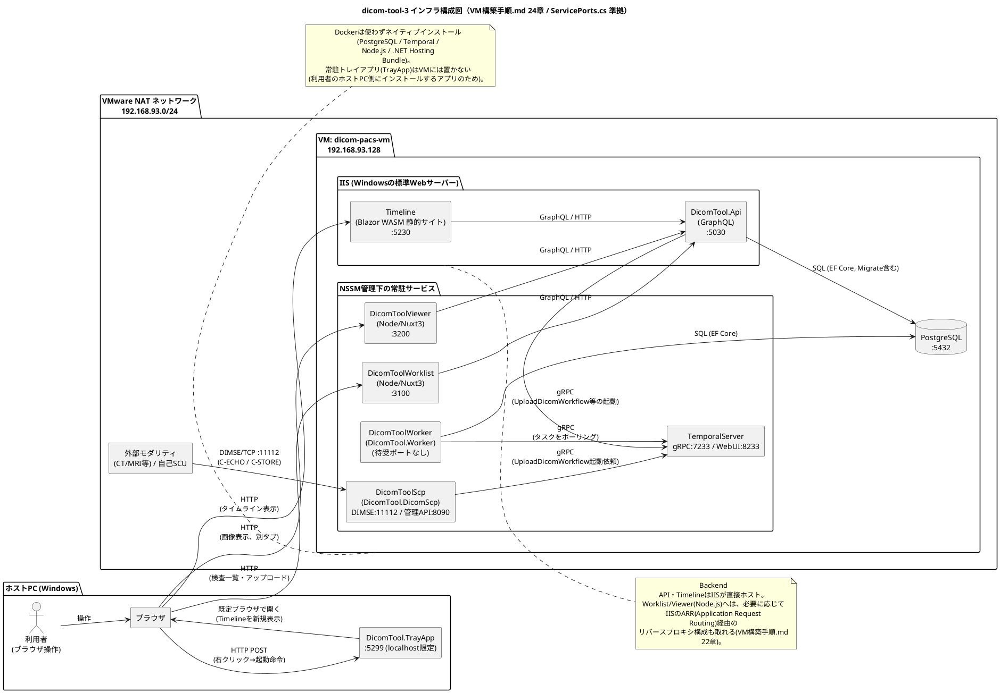

# インフラ構成図（PlantUML）

> このドキュメントは、実際にVM上にどうデプロイされているか（[`VM構築手順.md`](../VM構築手順.md)
> 24章のファイアウォール一覧が一次情報源）と、ポート番号の唯一の正である
> [`shared/DicomTool.Shared/Constants/ServicePorts.cs`](../shared/DicomTool.Shared/Constants/ServicePorts.cs)
> を元に、現在のインフラ構成をPlantUML図として可視化したものです。
>
> [`docs/architecture.md`](./architecture.md)の構成図（Mermaid、リクエストフロー中心）と
> 役割が重ならないよう、こちらは「実際にどのマシン(ホストPC / VM)の上に何が乗っていて、
> どのポートで通信しているか」という**物理配置**に焦点を当てています。処理の流れの詳細
> （なぜTemporalを挟むか等）は`docs/architecture.md`・`docs/CONTRACT.md`を参照してください。

---

## 図の見方

- ホストPC（あなたが普段使っているWindows PC）と、VMware上の仮想マシン`dicom-pacs-vm`を
  それぞれ大きな箱として分けています。
- 両者は`192.168.93.0/24`というVMware NATの仮想ネットワークの中でIPアドレスを持ち、
  相互に通信できます（ホストPCから見たVMのIPが`192.168.93.128`、`VM構築手順.md` 0章・9章参照）。
- 矢印のラベルは「何のプロトコルで」「何のために」通信するかを表しています。

---

## ポート番号の対応表（再掲・出典明記）

このドキュメントに書いたポート番号はすべて次の2つの一次情報源と一致させています。差異が
生じた場合はこの2つのファイルが正であり、本ドキュメントの図を修正してください。

| コンポーネント | ポート | 出典 |
|---|---|---|
| DicomTool.TrayApp | 5299 | `ServicePorts.TrayAppHttp` |
| DicomTool.Api (GraphQL) | 5030 | `ServicePorts.BackendApiHttp` |
| Timeline (Blazor WASM) | 5230 | `ServicePorts.TimelineBlazor` |
| DicomToolScp DIMSE | 11112 | `ServicePorts.DicomScpDimse` |
| DicomToolScp 管理API | 8090 | `ServicePorts.DicomScpManagementHttp` |
| TemporalServer gRPC | 7233 | `ServicePorts.TemporalFrontendGrpc` |
| TemporalServer Web UI | 8233 | `ServicePorts.TemporalWebUi` |
| DicomToolWorklist (Nuxt) | 3100 | `ServicePorts.WorklistNuxt` |
| DicomToolViewer (Nuxt) | 3200 | `ServicePorts.ViewerNuxt` |
| PostgreSQL | 5432 | `ServicePorts.PostgresHost` |

`VM構築手順.md` 24章のファイアウォール受信規則一覧も、上記と同じポート番号で構成されています
（DicomToolWorkerのみ待受ポートを持たないため、ファイアウォール規則の対象外です）。
