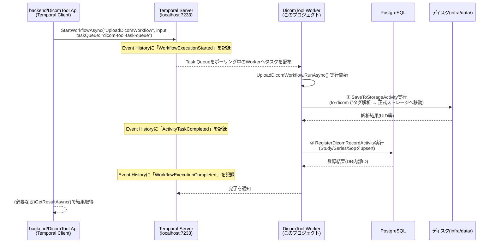
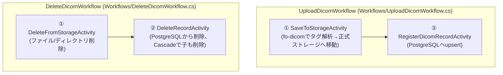

# Temporalワークフロー学習ガイド

> このドキュメントは `services/DicomTool.Worker` の実装と対で読むことを想定した学習資料です。
> 「Temporalとは何か」を知らない前提から出発し、最終的に「このリポジトリのどのファイルが
> どの概念に対応するか」まで一直線に繋げます。実装そのものの契約(ポート番号・識別子・
> データフロー)は `docs/CONTRACT.md` が正であり、本ドキュメントはその**背景にある考え方**を
> 補足するものです。

## 1. Temporalとは何か、なぜ必要か

Temporalは「複数ステップからなる処理を、信頼性高く実行し続けるためのワークフローエンジン」です。
一言でいうと、**「処理の途中でプロセスが落ちても、続きから正しく再開できる」**ことを保証してくれる
基盤です。

### 1.1 素朴な実装の何が問題か

このリポジトリでいえば、「DICOMファイルを受信 → 正式ストレージへ保存 → DBへ登録」という
2ステップの処理を考えます。もしこれを普通の1本のメソッドとして書いたら:

```csharp
async Task UploadOneAsync(...)
{
    await SaveToStorageAsync(...);   // ① ここでプロセスがクラッシュしたら？
    await RegisterToDbAsync(...);    // ② ファイルは保存されたのにDBには登録されない
}
```

①が終わった直後にWorkerプロセスがクラッシュ（デプロイ・OOM・サーバー再起動等）すると、
「ファイルはディスクにあるのにDBには登録されていない」という中途半端な状態が残ります。
これを人力で検知して手動リカバリするのは現実的ではありません。

### 1.2 Temporalが解決すること

Temporalは「ワークフローの実行状態」をプロセスのメモリではなく、Temporal Server側に
**永続化された「これまでに起きた出来事の履歴(Event History)」**として保持します。
Workerが再起動しても、Temporal Serverに保存された履歴を元に「どこまで終わっていたか」を
正確に復元し、続きから自動的に再開できます。

これにより以下が実現されます:

- **信頼性のある実行**: 途中で失敗しても、設定したポリシーに従って自動的にリトライされる。
- **可視性(Visibility)**: 「今どのワークフローが実行中か」「どこで失敗して何回リトライしたか」を
  Web UI([2.4節](#24-temporal-web-uiでの確認方法)参照)でいつでも確認できる。
- **疎結合な呼び出し**: 呼び出す側(`backend/DicomTool.Api`等)はワークフローの実装を一切知らずに、
  「Task Queue名」と「Workflow Type名」という2つの文字列だけで起動できる
  (`docs/CONTRACT.md` 4章)。

## 2. 全体像 ― Workflow / Activity / Task Queue / Worker の関係

### 2.1 4つの登場人物

| 用語 | 一言でいうと | このリポジトリでの実体 |
|---|---|---|
| **Workflow** | 「処理の実行計画」を書いたコード。決定性が必要([3章](#3-ワークフローの決定性制約)参照) | `Workflows/UploadDicomWorkflow.cs`、`Workflows/DeleteDicomWorkflow.cs` |
| **Activity** | 実際にI/O(ディスク・DB・HTTP等)を行う処理の単位 | `Activities/*.cs` の4クラス |
| **Task Queue** | Workflow/Activityの実行依頼が積まれる「順番待ちの列」の名前 | `"dicom-tool-task-queue"` (`TemporalConstants.TaskQueue`) |
| **Worker** | Task Queueをポーリングし、実際にWorkflow/Activityのコードを実行するプロセス | `services/DicomTool.Worker` そのもの（このプロジェクト） |

### 2.2 誰が何を呼ぶか



ポイントは、**WorkerがTemporal Serverに「自分から」接続しにいく**（＝Workerは待受ポートを
一切持たない）という点です。`docs/CONTRACT.md` 1章で「Temporal Worker: 待受ポートなし」と
書かれているのはこのためです。Workerは常にTask Queueをポーリングし続け、タスクが来たら
拾って実行する、という「取りに行く」側のモデルになっています。

### 2.3 このリポジトリでの2つのワークフロー



両ワークフローとも「ストレージ操作」と「DB操作」を別Activityに分離しています。理由は
`docs/CONTRACT.md` 2章・3章、および各Activity/Workflowファイルのコメントに詳しく書いていますが、
要点は次の2つです。

1. **失敗の種類が違う**: ディスクI/O(ディスクフル等)とDB I/O(接続断等)は原因も対処も別物。
   1つのActivityにまとめると、DBだけの一時障害で「既に成功しているファイル移動」まで
   無駄に再実行してしまう。
2. **Temporalのリトライ粒度がActivity単位**: Activityを適切に分けることで、
   「失敗した処理**だけ**」を過不足なく再試行できる。

### 2.4 Temporal Web UIでの確認方法

`docker compose up -d` でインフラ一式（PostgreSQL・Temporal Server・Temporal Web UI）を
起動した後、ブラウザで **http://localhost:8233** を開くと、実行された/実行中のワークフローの
一覧・履歴を確認できます。

1. 左のWorkflowsメニューで、Workflow ID・Workflow Type(`UploadDicomWorkflow`等)・Statusで
   絞り込みながら一覧を見られる。
2. 個々のワークフローをクリックすると、「Event History」が時系列で表示される
   (`WorkflowExecutionStarted` → `ActivityTaskScheduled` → `ActivityTaskCompleted` → ... →
   `WorkflowExecutionCompleted`)。これが1.2節で説明した「永続化された出来事の履歴」の実体。
3. Activityが失敗してリトライしている場合は `ActivityTaskFailed` が複数回記録され、
   何回目の試行でどんなエラーが出たかを確認できる。
4. 「Pending Activities」欄では、今まさに実行待ち・リトライ待ちのActivityの状態
   (次回リトライまでの残り時間等)を見られる。

学習用途では、わざと存在しないファイル名を`UploadDicomWorkflowInput.StagingFileName`に
指定してワークフローを起動し、`ApplicationFailureException(nonRetryable: true)`が
即座に失敗として記録される様子や、PostgreSQLコンテナを一時停止した状態で削除ワークフローを
起動し、`RetryPolicy`に従って一定間隔でリトライされる様子をWeb UI上で観察してみると、
本ガイドの内容が体感的に理解できます。

## 3. ワークフローの決定性制約

### 3.1 なぜ必要か

Temporalは「ワークフローの状態」をメモリ上の変数としてではなく、「Event History」という
出来事の記録として保存すると説明しました。Workerが再起動した後にワークフローの続きを
実行するとき、Temporal .NET SDKは実は**ワークフローのコードを最初から再実行**します。
これを「リプレイ(Replay)」と呼びます。

リプレイの際、SDKは「今から実行しようとしている行動」と「Event Historyに既に記録されている
過去の行動」を突き合わせ、一致していれば「これは既に完了済みだから、記録されている結果を
そのまま使い、実際には再実行しない」と判断します。例えば`Workflow.ExecuteActivityAsync`を
呼んだ箇所は、リプレイ時にはActivityを実際にもう一度実行するのではなく、
Event Historyに記録済みの結果をそのまま返します(だからこそActivity内の副作用が
二重に起きない)。

この仕組みが正しく動くための絶対条件が「**決定性(Determinism)**」です。

> 同じEvent Historyを入力として与えたら、ワークフローのコードは
> 何度実行しても必ず全く同じ順序で同じ判断をしなければならない。

### 3.2 やってはいけないこと

決定性を壊す代表例（このリポジトリのワークフロー本体では一切使っていません）:

| 禁止事項 | なぜ壊れるか |
|---|---|
| 直接のファイルI/O・DB I/O・HTTP呼び出し | 実行タイミングやその時の外部状態によって結果が変わりうる |
| `DateTime.Now` / `DateTime.UtcNow` | 実行するたびに違う値になる |
| `Guid.NewGuid()`、`Random` | 実行するたびに違う値になる |
| `Thread.Sleep`、`Task.Run`によるスレッド操作 | 実行順序が非決定的になる |

これらがどうしても必要な場合は、Temporal SDKが提供する決定性を保証したAPI
(`Workflow.UtcNow`、`Workflow.Random`、`Workflow.DelayAsync`等)を使います。これらはSDK内部で
「その値自体もEvent Historyに記録し、リプレイ時は記録された値を再利用する」ことで
決定性を保っています。

### 3.3 このリポジトリでの対処

`Workflows/UploadDicomWorkflow.cs`・`Workflows/DeleteDicomWorkflow.cs`を見ると分かる通り、
ワークフロー本体がしていることは「どのActivityを」「どんな順序で」「どんなオプションで」
呼ぶかという実行計画の組み立てだけです。実際のファイルI/O・DB I/O・現在時刻の取得
（DICOMタグに日付が無い場合のフォールバック等）は、すべて`Activities/`配下の各クラスに
完全に閉じ込められています。**Activityの中身には決定性の制約がありません**（Activityの
実行結果自体がEvent Historyに記録される対象であり、リプレイ時に再実行されないため）。
これが「ストレージ操作とDB操作を別Activityに分離する」という設計判断の、決定性の観点からの
もう1つの理由でもあります。

## 4. リトライポリシーの考え方

Activity呼び出し時に渡す`ActivityOptions.RetryPolicy`は、「失敗したときにどう再試行するか」を
制御します（`Temporalio.Common.RetryPolicy`）。主なパラメータ:

| パラメータ | 意味 |
|---|---|
| `InitialInterval` | 1回目の再試行までの待ち時間 |
| `BackoffCoefficient` | 再試行のたびに待ち時間を何倍に伸ばすか（指数バックオフ） |
| `MaximumInterval` | 待ち時間の上限（指数的に伸び続けないようにする） |
| `MaximumAttempts` | 最大何回まで試行するか（0=既定値は無制限） |
| `NonRetryableErrorTypes` | このエラー型が発生したら再試行しない、という指定 |

### 4.1 「再試行すべき失敗」と「再試行しても無駄な失敗」を区別する

このリポジトリのActivity実装(`Activities/SaveToStorageActivity.cs`等)では、失敗を2種類に
明確に分けています。

- **一過性の失敗**（ディスク一時ロック、DB接続の瞬断等） →
  普通の例外を投げるだけでよい。Temporal .NET SDKは「Activity内で投げた非Temporal例外」を
  自動的に「リトライ可能な`ApplicationFailureException`」に変換してくれるため、
  ワークフロー側で設定した`RetryPolicy`に従って自動的に再試行される。
- **恒久的な失敗**（ステージングファイルが存在しない、DICOMとして壊れている、
  UIDタグが読めない等） →
  `throw new ApplicationFailureException(message, nonRetryable: true)`を明示的に投げる。
  これは「ワークフロー側がどんなRetryPolicyを設定していても即座に失敗を確定させる」ための
  指定であり、直しようがない失敗に対して無駄なリトライでリソースを消費しないための工夫。

### 4.2 このリポジトリでの具体的な数値と根拠

`Workflows/UploadDicomWorkflow.cs`・`Workflows/DeleteDicomWorkflow.cs`のコード中コメントに
数値ごとの根拠を書いていますが、要約すると:

- **ストレージ系Activity**（`SaveToStorageActivity`、`DeleteFromStorageActivity`）:
  `InitialInterval=2秒, BackoffCoefficient=2.0, MaximumInterval=30秒, MaximumAttempts=5,
  StartToCloseTimeout=1分`。ディスクI/Oの一過性障害は数秒〜数十秒待てば解消することが
  多いという経験則から、初期間隔をやや長めに取っている。
- **DB系Activity**（`RegisterDicomRecordActivity`、`DeleteRecordActivity`）:
  `InitialInterval=1秒, BackoffCoefficient=2.0, MaximumInterval=20秒, MaximumAttempts=5,
  StartToCloseTimeout=30秒`。DB再接続は一般にファイルI/Oの復旧より速いため、
  初期間隔をやや短めにしている。

`MaximumAttempts`をあえて有限（5回）にしているのは、学習用途で「本当に直らない障害が
起きたときに、ワークフローが未来永劣Pendingのままにならず、はっきり失敗が見える」ように
するための意図的な選択です（既定値の0=無制限リトライにしないという判断）。

### 4.3 べき等性(Idempotency) ―― at-least-once実行保証との組み合わせ

Temporalは各Activityの実行を「**最低1回**は実行される(at-least-once)」ことしか保証しません
（「ちょうど1回」ではない）。例えば、Activityの処理自体（DBへのINSERT等）は成功したのに、
その直後にWorkerがクラッシュして「成功しました」という応答がTemporal Serverに届かなかった
場合、Temporalは安全側に倒して同じActivityをもう一度実行します。

そのため、Activityは「同じ入力で2回実行されても、最終的な結果が変わらない」＝**べき等**に
作る必要があります。このリポジトリでの実装例:

- `RegisterDicomRecordActivity`: SOP Instance UIDが既にDBにあれば新規作成せず、
  既存レコードのIDをそのまま返す(`Activities/RegisterDicomRecordActivity.cs`)。
- `DeleteFromStorageActivity` / `DeleteRecordActivity`: 削除対象が既に存在しなくても
  例外にせず、「目的(存在しないこと)は既に達成されている」として正常終了扱いにする。

## 5. このリポジトリの実装ファイル対応表

| 概念 | ファイル | 補足 |
|---|---|---|
| Workflow定義(アップロード) | `services/DicomTool.Worker/Workflows/UploadDicomWorkflow.cs` | `[Workflow]` + `[WorkflowRun]` |
| Workflow定義(削除) | `services/DicomTool.Worker/Workflows/DeleteDicomWorkflow.cs` | 同上 |
| Activity(ストレージ保存) | `services/DicomTool.Worker/Activities/SaveToStorageActivity.cs` | fo-dicomでタグ解析 |
| Activity(DB登録) | `services/DicomTool.Worker/Activities/RegisterDicomRecordActivity.cs` | `DicomDbContext`経由でupsert |
| Activity(ストレージ削除) | `services/DicomTool.Worker/Activities/DeleteFromStorageActivity.cs` | |
| Activity(DB削除) | `services/DicomTool.Worker/Activities/DeleteRecordActivity.cs` | Cascade設定はSharedのDbContext側 |
| Activity間の受け渡しDTO | `services/DicomTool.Worker/Activities/SaveToStorageActivityResult.cs`ほか | Worker内部限定。他プロセスは知らない |
| Workerプロセスの起動・DI登録 | `services/DicomTool.Worker/Program.cs` | `AddHostedTemporalWorker` / `AddScopedActivities` / `AddWorkflow` |
| ワークフロー入力の共通契約 | `shared/DicomTool.Shared/Contracts/UploadDicomWorkflowInput.cs`、`DeleteDicomWorkflowInput.cs` | Api/DicomScp側もこれを参照 |
| Task Queue名・Workflow Type名 | `shared/DicomTool.Shared/Constants/TemporalConstants.cs` | 呼び出し側との「文字列の約束事」 |
| ストレージパス規約 | `shared/DicomTool.Shared/Constants/StoragePaths.cs` | ステージング/正式ストレージの相対パス解決 |
| DBスキーマ定義 | `shared/DicomTool.Shared/Data/DicomDbContext.cs`、`Entities/*.cs` | Cascade設定はここ |

## 6. 参考リンク

- Temporal .NET SDK 本体: https://github.com/temporalio/sdk-dotnet
- 公式サンプル集(依存性注入パターンは`src/DependencyInjection`、Generic Host統合は
  `src/AspNet`を参照): https://github.com/temporalio/samples-dotnet
- NuGetパッケージ: https://www.nuget.org/packages/Temporalio /
  https://www.nuget.org/packages/Temporalio.Extensions.Hosting
- Temporal公式ドキュメント(概念解説): https://docs.temporal.io/
